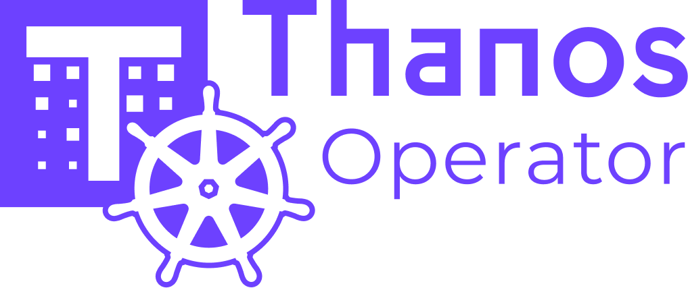

<p align="center"></p>

# Thanos Operator

[](https://goreportcard.com/report/github.com/thanos-community/thanos-operator) [](https://pkg.go.dev/github.com/thanos-community/thanos-operator?tab=subdirectories) [](https://cloud-native.slack.com/archives/C080V0HNV8W)

[](https://github.com/thanos-community/thanos-operator/actions/workflows/push.yaml) [](https://github.com/thanos-community/thanos-operator/actions/workflows/go.yml) [](https://github.com/thanos-community/thanos-operator/actions/workflows/docs.yaml) [](https://app.netlify.com/projects/thanos-operator/deploys)

> [!NOTE]
>
> This operator is still a work in progress so APIs are in alpha state.

## Overview

The Thanos Operator provides Kubernetes native deployment and management of Thanos components. The purpose of this project is to simplify and automate the configuration of a Thanos based monitoring stack that would work across different topologies and deployment modes.

The Thanos operator includes, but is not limited to, the following features:

* **Kubernetes Custom Resources**: For Thanos Receive, Thanos Ruler, Thanos Store Gateway, Thanos Compactor and Thanos Querier. For Thanos Sidecar, please use [Prometheus CRD](https://prometheus-operator.dev/docs/api-reference/api/#monitoring.coreos.com/v1.Prometheus) from Prometheus-Operator.

* **Simplified Deployment Configuration**: Configure fundamental and advanced topologies wth simplified CRDs that can be composed into architecture of your choice.

* **Extensability with multi-cluster technologies**: Shares Thanos' philosophy of operating in multi-cluster environments. Provides extensible configuration so that you can easily manage Thanos installation with other multi-cluster technologies/initiatives like custom operators or [Open Cluster Management](https://open-cluster-management.io/).

For more details, read how to [get started](#getting-started) and explore our [CRD docs](docs/api-reference/api.md)

Or visit our website: https://thanos-operator.dev/!

## Usage

We publish images from each commit to main and per-release at https://quay.io/thanos/thanos-operator

Thanos Operator binary CLI Options include,

```bash mdox-exec="./bin/manager --help"
Usage of ./bin/manager:
  -enable-feature value
    	Experimental feature to enable. Repeat for multiple features. Available features: service-monitor, prometheus-rule.
  -enable-http2
    	If set, HTTP/2 will be enabled for the metrics and webhook servers
  -health-probe-bind-address string
    	The address the probe endpoint binds to. (default ":8081")
  -kubeconfig string
    	Paths to a kubeconfig. Only required if out-of-cluster.
  -leader-elect
    	Enable leader election for controller manager. Enabling this will ensure there is only one active controller manager.
  -log.format string
    	Output format of log messages. One of: [logfmt, json] (default "logfmt")
  -log.level string
    	Only log messages with the given severity or above. One of: [debug, info, warn, error] (default "info")
  -metrics-bind-address string
    	The address the metric endpoint binds to. (default ":8080")
  -metrics-secure
    	If set the metrics endpoint is served securely
```

CRDs supported by this operator are defined in [./config/crd/bases](./config/crd/bases/). Operator deployment manifests are defined in [./config/manager](./config/manager/). To edit and build configuration refer to [CRD docs](docs/api-reference/api.md).

## Getting Started

To install CRDs run,

```bash
make install
```

To deploy operator run,

```bash
make deploy IMG="<IMAGE_NAME>"
```

IMAGE_NAME here is usually `example.com/thanos-operator:v0.0.1` for testing/local and `quay.io/thanos/thanos-operator:main-YYYY-MM-DD-COMMIT` (can reference latest from [quay](https://quay.io/thanos/thanos-operator))

To deploy [example manifests](./config/samples/), which give you a local [MinIO](https://min.io/) object storage instance and Thanos installation in Receive architecture, run,

```bash
make install-example
```

### Interactive Demo

To test out the operator with a local Kubernetes cluster you can run an interactive demo in KinD. You will firstly need to install [mage](https://magefile.org/) and then run the following commands:

```bash
mage interactiveDemo
```

Once the workloads are ready, run `kubectl -n thanos-operator-system port-forward svc/thanos-query-frontend-example-query 9090` and visit `http://localhost:9090` to via the query UI.

This demo consists of a Prometheus, deployed via Prometheus Operator, that scrapes metrics from the operator and the Thanos components themselves. It remote writes to the Thanos Receive component.

Read more about getting started [here](docs/get-started.md) and how to [install](docs/installation.md) here!

### Feature Gates

The controllers within Thanos Operator have the ability to extend behaviour beyond standard features. This behaviour is generally controlled behind feature gates since it may require the presence of other operators or components.

Feature flags can be enabled using the `--enable-feature` flag. The following feature gates are available:

`service-monitor` - Enables ServiceMonitor management by the operator for Thanos components it deploys. This requires Prometheus Operator to be installed in the cluster.

`prometheus-rule` - Enables PrometheusRule discovery for Thanos Ruler. This requires Prometheus Operator to be installed in the cluster. This allows ThanosRuler to discover PrometheusRule objects in the cluster and apply them to itself.

`kube-resource-sync` - Enables [kube-resource-sync](https://github.com/philipgough/kube-resource-sync) sidecar for Thanos Receive router deployments. This provides immediate synchronization of ConfigMap changes without requiring pod restarts.

## Contributing and development

Requirements to build, and test the project,

```
Go 1.24+
Linux or macOS
KinD 
kubectl
```

You can read about our goals and design decisions [here](docs/proposals/design.md)!

Any contributions are welcome! Just use GitHub Issues and Pull Requests as usual. We follow [Thanos Go coding style guide](https://thanos.io/tip/contributing/coding-style-guide.md/).

Have questions or feedback? Join our slack channel [#thanos-operator](https://cloud-native.slack.com/archives/C080V0HNV8W)!

## Testing

The following `make` targets are available for testing:

1. `make test` - Runs unit and integration tests.
2. `make test-e2e` - Runs e2e tests against a Kubernetes cluster.

When executing integration tests, the following environment variables can be used to skip specific, per-controller tests:
* EXCLUDE_COMPACT=true
* EXCLUDE_QUERY=true
* EXCLUDE_RULER=true
* EXCLUDE_RECEIVE=true
* EXCLUDE_STORE=true

As an example, to run only integration tests for ThanosStore, you can run the following command:

```bash
EXCLUDE_COMPACT=true EXCLUDE_QUERY=true EXCLUDE_RULER=true EXCLUDE_RECEIVE=true make test
```

### Golden File Testing

The Thanos Operator uses golden file testing for manifest generation tests. Golden files contain the expected YAML output for Kubernetes resources and are located in `testdata/` directories within each package. They are named according to the test scenario they represent.

#### Updating Golden Files

When you modify manifest generation code, you may need to update the golden files to reflect the new expected output:

```bash
# Update golden files for all manifest packages
make test-update-golden
```

## Initial Authors

[@philipgough](https://github.com/PhilipGough) [@saswatamcode](https://github.com/saswatamcode)

## Logos and Artwork

[@sjcox-rh](https://github.com/sjcox-rh)
