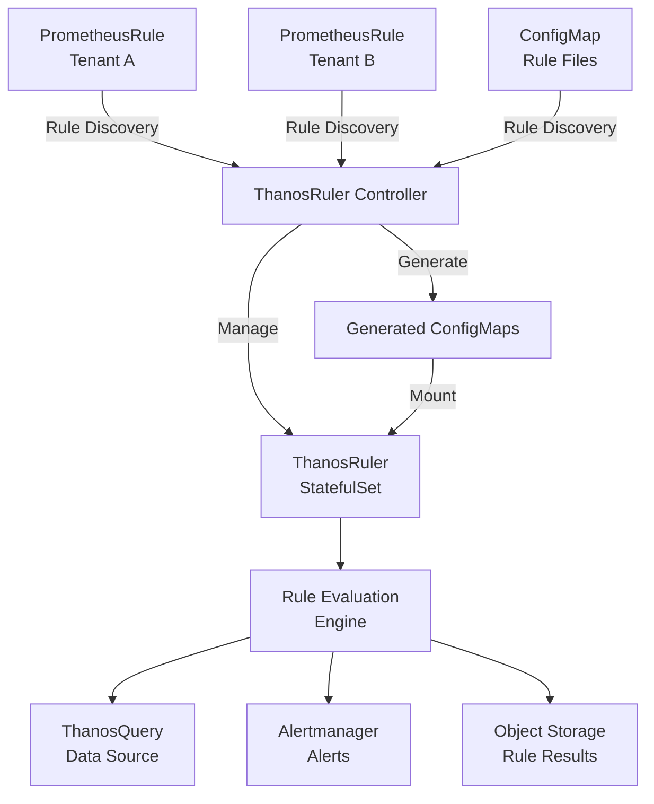

# ThanosRuler

The `ThanosRuler` CRD manages the [Thanos Ruler component](https://thanos.io/tip/components/rule.md/).
Thanos Ruler evaluates Prometheus recording and alerting rules using data from Thanos Query.
It provides distributed rule evaluation with high availability and multi-tenancy support.
Alerts can be sent to an [Alertmanager](https://prometheus.io/docs/alerting/latest/alertmanager/) instance.

## Overview

Thanos Ruler performs several key functions:

- **Rule Evaluation**: Executes Prometheus recording and alerting rules at regular intervals
- **Alert Generation**: Sends alerts to Alertmanager based on rule evaluation results
- **Recording Rules**: Creates new time series from existing data
- **Multi-tenancy**: Supports tenant-specific rule isolation

## Features

### Modes

#### Stateful Mode

### Discovery

The controller discovers `ConfigMaps` and optionally [`PrometheusRule`](https://prometheus-operator.dev/docs/api-reference/api/#monitoring.coreos.com/v1.PrometheusRule) objects.
Discovery is based on label selectors and configured via the [`ThanosRuler` spec](https://thanos-operator.dev/docs/api-reference/api.md/#thanosrulerspec) `ruleConfigSelector` field.

Once discovered, these resources are written to one or more `ConfigMaps` owned by the `ThanosRuler` instance.

### Tenancy

The controller can optionally enforce tenancy on the discovered rules.
This allows end users to self-service and manage their own `PrometheusRule` objects without interfering with other tenants.
The controller will inject the tenant into the discovered rules.
Configuration is managed as configured via the [spec](https://thanos-operator.dev/docs/api-reference/api.md/#ruletenancyconfig).
The `enforcedTenantIdentifier` field (default `tenant_id`) sets the identifier (a Prometheus label key) to inject into the rules.
The `tenantSpecifierLabel` field (default `operator.thanos.io/tenant`) sets the label key on the objects to read the tenant value from.

The rule expressions in the generated rules will be modified to include the tenant label. For example, `tenant_id="my-tenant"`.

### Sharding

There are a number of strategies to implement sharding of rules across if sharded evaluation is desired.

#### Manual Sharding

An operator can create multiple `ThanosRuler` instances, each with its own `ruleConfigSelector` to select a subset of the rules.
Those rules will be managed and evaluated by that specific `ThanosRuler` instance.


## Architecture



## Basic Configuration

### Minimal Example

```yaml
apiVersion: monitoring.thanos.io/v1alpha1
kind: ThanosRuler
metadata:
  name: example-ruler
spec:
  replicas: 1
  ruleConfigSelector:
    matchLabels:
      operator.thanos.io/rule-file: "true"
      operator.thanos.io/tenant: "thanos"
  queryLabelSelector:
    matchLabels:
      operator.thanos.io/query-api: "true"
      app.kubernetes.io/part-of: "thanos"
  defaultObjectStorageConfig:
    name: thanos-object-storage
    key: thanos.yaml
  alertmanagerURL: "http://alertmanager.example.com:9093"
  externalLabels:
    rule_replica: "$(NAME)"
  evaluationInterval: 1m
  retention: 2h
  storage:
    size: 1Gi
  logFormat: logfmt
  imagePullPolicy: IfNotPresent
```
