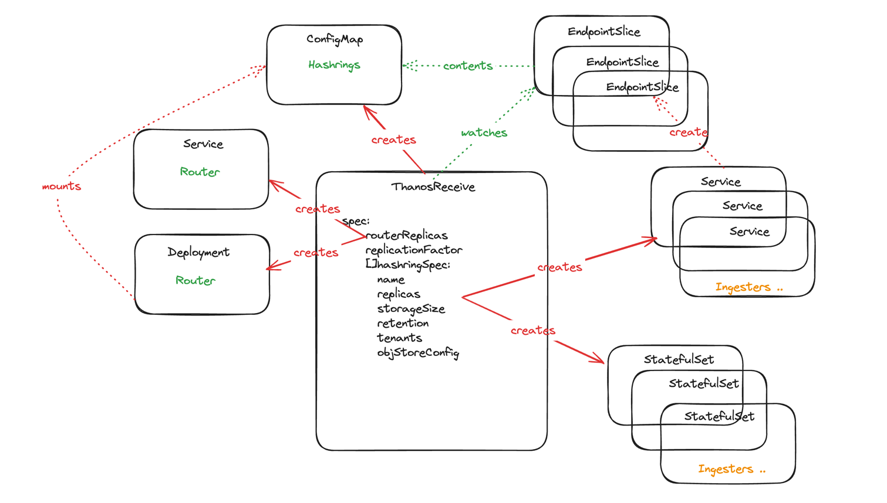
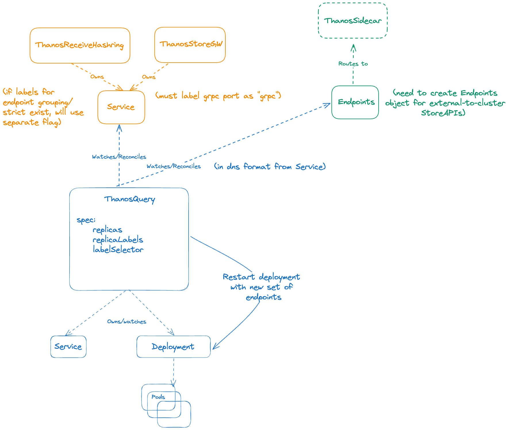

## Summary

This document aims to specify the design for a metrics operator that enables multi-cluster observability use cases, backed by a [Thanos](https://thanos.io/) metrics backend.

## Why

There are a couple of main reasons for creating a new operator offering,

* Currently, no upstream option exists for managing Thanos installations on K8s.
* There is existing [Observatorium Operator offering](https://github.com/observatorium/operator), that makes use of a unique tool called [locutus](https://github.com/brancz/locutus). While this is functional and innovative, it relies on static configuration to render K8s objects, which leads to an un-customizable installer rather than an operator. Also, using a pattern that is not widely adopted, results in very low community adoption/contribution.

## Goals

* Ensure the operator is designed with consistent upstream-friendly design decisions and patterns
* Ensure the operator builds on top of the existing upstream ecosystem instead of redefining
* Ensure the operator provides a fully functional yet opinionated Thanos installation

## Non-Goals

* Creation and direct management of tenancy and authorization/authentication: Mechanisms for these need to be delegated to other technologies like Observatorium API, Keycloak, OpenPolicyAgent, and SpiceDB, and there are designs underway to facilitate this. Thanos Operator would only provide the tenancy primitives needed.
* Collection/scraping: This operator is designed to be a central metrics sink, collection would likely be delegated to things like Prometheus Operator, Otel Collector, etc.
* Multicluster operations: While this operator plays a crucial role in multicluster use cases, it will not be responsible for multicluster workload scheduling of any kind. Instead a separate design can be created using this operator as its base and leveraging open standard for multicluster management frameworks.
* Exhaustively supporting previous versions of Thanos where the latest v0.35.0 is the starting point.

## How

### Per Component Use Cases & Design

The following sections outline the identified use cases and stories per component and present one or more designs for discussion that cover those cases. Designs may change as we begin to develop the project if the proposed and accepted solutions become unviable for any reason.

### Metrics Ingest

#### Proposed Design: Receive

We propose that there should be a single CRD for Thanos Receive.

*ThanosReceive* will be responsible for managing the lifecycle of Receive routing and ingest components. It will manage the hashring configuration for the ingest components that it deploys.

**Option One - Split routing and metrics ingest components**

***“As a developer, I want to be able to spin up Thanos Receive as a remote write sink with minimal configuration and simple documentation.”***

A single custom resource will manage the full configuration of metrics ingestion. Hashring configuration will be managed by default without the need for a third party controller/component.

***“As an operator of a multi-tenant metrics backend, I want to be able to deploy multiple distinct configurations with respect to metrics object storage targets, retention, data replication factor and the hashing algorithm used.”***

We will support managing multiple hashrings in a single spec. Each hashring can have distinct configuration. Replication factor will be tied to the router so this will not be configurable per hashring. Additional custom resources can be created to manage different data replication requirements.

***“As an operator of a multi-tenant metrics backend, I want to be able to offer different levels of service to different tenants (shared infrastructure/hard tenancy).”***

Full hard tenancy can be supported by creating a dedicated custom resource per tenant. A single custom resource can support shared routing and hard tenancy across ingesters by specifying multiple hashrings. Shared routing and shared ingest can be supported by passing multiple tenants to the tenant list in hashring configuration.

***“As an operator of a multi-tenant metrics backend, I want to be able to easily move tenants around without data loss and/or service disruption.”***

Hashring configurations will be updated dynamically at runtime by the controller. Tenants can safely be added or removed from a hashring without disruption.

***“As an operator of a multi-tenant metrics backend, I want to be able to do blue/green deployments for new Thanos releases”***

We will support adding custom image and version overrides per router/ingester.

### Metrics Query

#### Proposed Design: Query

We propose that there should be a single CRD for Thanos Query, as one end of the metrics query path.

*ThanosQuery* will be responsible for managing the lifecycle of Querier deployments and handle automatically finding and connecting Thanos StoreAPI implementations to the Querier via labels/ownerreferences and restarting them if necessary. It will also allow for certain types of endpoint config such as HA grouping or strict depending on labels.

**Option One - Endpoint flag-based Auto Service Discovery (always restarts)**

***“As a developer, I want to be able to spin up Thanos Query as a global view where I can see all my data, both in and out of cluster.”***

This can be achieved by spinning up a ThanosQuery CR with minimal config, and deploying Services (that could be owned by other components in this Operator with required labels) or Endpoints objects that route to out-of-cluster addresses.

***“As an operator of a multi-tenant metrics backend, I want to have queries that combine data from store, receive, and sidecar.”***

This is doable as ThanosQuery will automatically discover Services with labels and use Thanos DNS notation to attach them as an endpoint using Query args, and restart Query for you.

***“As an operator of a scalable metrics backend, I want to have queries that round robin series calls to HA groups of StoreAPI endpoints”***

This is possible by adding a special label to services for your HA StoreAPI, which will cause the controller to configure them as endpoint-group flag. You can do the same for strict endpoints.

***“As an operator of a multi-tenant metrics backend, I want to only attach certain StoreAPIs to particular Query deployments and provide separate QoS to different tenants.”***

You can create individual ThanosQuery CRs with custom label selectors, so they only look for Services having those labels.

***“As an operator of a multi-tenant metrics backend, I want to be able to run a distributed query engine for Thanos.”***

While not planned for initial implementation, fields like *Distributed* and *ShardingLabels* can be added to the CR to allow it to spin up a query tree with distributed mode, which shards across labels you select.

**Option Two - File-based Auto Service Discovery (only restart for group/strict endpoint)**

The only point of difference in this implementation is that we are using an SD file for endpoints. This ensures that Query pods don’t need to be restarted unless there is a change in endpoint-group or strict Services.

***“As a developer, I want to be able to spin up Thanos Query as a global view where I can see all my data, both in and out of cluster.”***

Same as prior implementation.

***“As an operator of a multi-tenant metrics backend, I want to have queries that combine data from store, receive, and sidecar.”***

Same as prior implementation.

***“As an operator of a scalable metrics backend, I want to have queries that round robin series calls to HA groups of StoreAPI endpoints”***

Same as prior implementation.

***“As an operator of a multi-tenant metrics backend, I want to only attach certain StoreAPIs to particular Query deployments provide separate QoS to different tenants.”***

Same as prior implementation.

***“As an operator of a multi-tenant metrics backend, I want to be able to run a distributed query engine for Thanos.”***

Same as prior implementation.

#### Proposed Design: Store

We propose that there should be a single CRD for Thanos StoreGW, representing the long-term aspect of the metrics query path.

ThanosStoreGW will be responsible for managing the lifecycle of Store GW shard deployments and handle automatically sharding StoreGWs for optimal querying. It will also provide sane defaults according to the caching implementation one would like to use.

***“As a developer, I want to be able to spin up Thanos Store Gateway shards to read all my data from objstore with minimal configuration.”***

This can be achieved by spinning up a ThanosStoreGW CR with minimal config and creating a Secret for objstore credentials in Thanos format, and ConfigMaps to connect custom caches (Otherwise we start In-memory caches by default).

***“As a developer, I want to be able to run Thanos Store Gateway shards with redis/memcached caches.”***

This can be achieved by deploying memcached/redis on your own and creating ConfigMaps which the ThanosStoreGW CR can refer to (or just providing type and address, which the operator can then use to create a default cache config). The remit of Thanos Operator is Thanos components only, so it does not set up these caches for you.

***“As an operator of a scalable metrics backend, I would like to shard my store gateway instances by time.”***

This is doable using the Sharding field of ThanosStoreGW CR. To shard by time, you can specify the raw block retention time and type as “time”. The controller will automatically set parameters on your Store shard StatefulSets so that each shard can read specific blocks split by time, and they don’t overlap. You can also set replicasPerShard so that each shard can be queried in HA fashion (by adding a query group label).

***“As an operator of a scalable metrics backend, I would like to shard my store gateway instances by blocks.”***

This is doable using the Sharding field of ThanosStoreGW CR. To shard by block, you can specify the type as “block” and blockModulo value (default is 6). The controller will automatically set parameters on your Store shard StatefulSets so that each shard has a hashmod selector based on block_id label. You can also set replicasPerShard so that each shard can be queried in HA fashion (by adding a query group label).

### Metrics Compaction

#### Proposed Design: Compactor

We propose that there should be a single CRD for Thanos Compactor. The initial implementation will be a simple compactor CRD that will support explicit sharding via external labels. We intend to add more complex shard management/automation in future iterations. Some ideas

1. Auto-discovery of external labels and shard creation based on those labels.
2. Time based sharding based on auto-discovery of a compaction backlog.

## Alternatives

### [Existing Thanos operator](https://github.com/banzaicloud/thanos-operator)

* There does not appear to be much in the way of active development
* Thanos receive support exists but it is not well documented
* It appears to favor a sidecar-based approach
* No native support for multi-tenancy
* Unclear/poor documentation for how scaling is handled
* Doesn’t seem to support limits at the moment
* [No convenient way to setup rules](https://github.com/banzaicloud/thanos-operator/issues/173)
* A limited amount of tests seems to be in place
* We’d likely need to make major contributions to make this fit for purpose for us, and given the current level of activity in the project, it might be hard for these to land upstream. Further, the effort for these major contributions are likely to be in the same general size as creating an operator from scratch.
